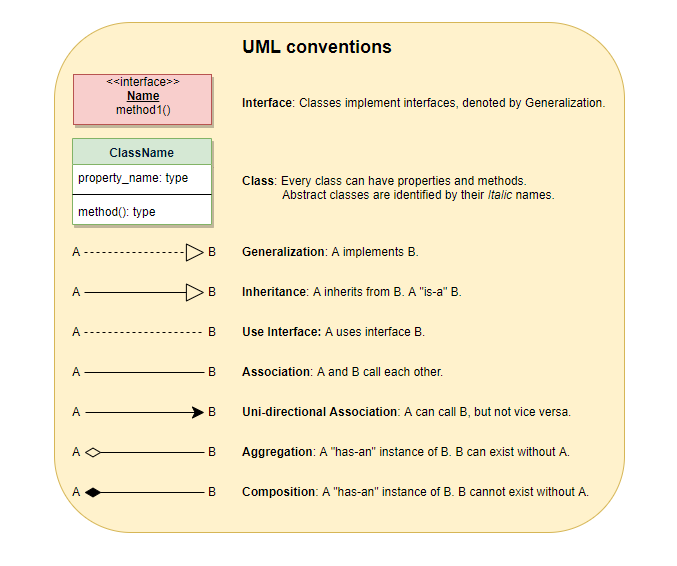

# 每日打卡

>从明天起，做一个幸福的人

>喂马、劈柴，周游世界

>从明天起，关心粮食和蔬菜

>我有一所房子，面朝大海，春暖花开

除了每天写写日记，也应该对每天做了什么有个记录。

* 2019-11-26

1、夏曹俊老师课程关提供了项目建立的模板、S2017项目配置的解释（[在文件夹vs2017_setting](../img/VS2017_Project_Setting/))。

2、wmware 桥接模式不能上网如何解决？

答：编辑-虚拟网络编辑器-更改设置-选桥接模式的那个网络-将"桥街到"，选择本机在用的物理网卡（去windows的网络适配器查看）

3、Ubuntu上一些命令（以前没有用过或者用过不晓得区别）

```bash

sudo passwd       #装好系统设置root密码
su -              #切换到root

# 网络设置通过设置/etc/netplan/下文件，提示did not find expected key的原因是缩进问题

# ps:我设置后出错了，记得本周提问如何设置,暂时不弄了，不影响接下来的学习

touch xxx   #更新文件最后的访问时间

ln -s #软连接，源文件被修改此文件会失效
ln    #硬连接
```
内联函数inline、常量const相关总结，在windows-dev这个repo中

* 2019-11-27

1、C++中引用的知识点。(在windows-dev/Cpp_Assembly中reference.md中查看）

2、进程。windows中进程往往对应一个执行文件，Linux中，一个程序可以通过fork对应多个进程，进程有守护进程、前台进程（Cril+C终止）、后台进程（kill终止），进程查看用ps -ef命令，可以显示进程进程名、进程标识、父进程标识、时间等信息。终止进程，可以发送以数字表示的信号给进程，通知其结束，默认是15，等待所占用资源释放后再结束，直接发送kill -9 进程编号，可以直接杀死进程，pkill则是根据进程名字结束进程。PS：nginx常常用作前端，客户端基于线程，满足高并发需求。

3、nohup可以将前台进程设置在后台执行，
```bash
# /dev/null/为删除输出信息，默认nohup.out中，也可以指定其他文件
# &1标注输出，&2错误输出
nohup tail -f /var/log/syslog > /dev/null/ &1 (标注输出) or &2(错误输出)
```
4、用户管理

```
# 添加用户(test)，设置密码，用户目录，添加组及该用户所属于的组

useradd test
passswd test
su test # 切换到用户test
pwd     # 当前路径 output:空

useradd -m test -d /home/test -s /bin/bash
groupadd cpp
gpasswd -a test cpp
```

5、GitHub解决冲突

假设用户1修改了 xxx文件，并且push了，我这边再修改后push会提示拒绝，有冲突，查看冲突：

    git diff master origin/master

建议将该文件备份，然后执行以下操作(备份，先拉取再合并）：

```bash
git pull
vim xxx  #对其进行更改
git add xxx
git commit "my work"
git push
```
6、GitHub创建本地仓库缓存，在本地构建GitHub云端方法

在机器a上执行

    git init --bare /home/hanxinle/xdisk.git

则在该机建立了一个暂存区。

在机器b执行

    git clone hanxinle@xx.mm.yy.zz:/home/hanxinle/xdisk.git

则将repo拉取到本地，在本地创建文件等更改后，执行add,commit,push操作，其它机器执行

    git clone hanxinle@xx.mm.yy.zz:/home/hanxinle/xdisk.git

则可以在得到与机器b一致的repo，PS，把两个操作存在[github_commands.md](github_commands.md)中。    

* 2019-11-28

1、编译与连接程序

```bash
#预处理,将头文件拷到源文件，宏定义替换
g++ -E hello.cpp -o hello.i
#编译，预处理的文件转变为汇编代码hello.s
g++ -S hello.i 
#汇编，将编译的结果生成二进制 hello.o
g++ -c hello.s
#链接，将上述过程的文件组合为可执行文件a.out（未用 -o指定输出文件的情形）
g++ hello.o
#执行，不可执行先运行 chmod +x a.out
./a.out
```
2、makefile书写的模板

```
[变量]
目标($@)：依赖($+)
[TAP]执行语句$(变量)    
```
2、socket编程入门（自己打程序体会socket工作的方式，同时补充相关网络知识）

3、深度工作

含义：认知能力最大化的工作状态

有助于深度工作的做法：（1）仪式感；（2）远离社交媒体等干扰；（3）独立的空间；（4）刻意练习，即每日拿出固定的时间来专门进行某一技能、知识、领域的针对性学习，训练。

4、emacs -nw 终端模式

* 2019-11-29

1、大事件：整理王老师代码留下来的编码规范，个人见过的最好的 <Personal C++ Coding Rules> 

2、详细了解了socket编程中，IP、port含义，结构体socketaddr_in的内部结构、含义，inet_addr等函数的使用及其含义。

3、程序员只要关注链路层、IP层、传输层、应用层（可以有下层无上层，决不能有上层无下层），IP层传输只关注一个数据包的传输过程，传输多个数据包的时候顺序及传输过程并不可靠，TCP和UDP作用于IP层之上，确定对方收到数据，并且将丢失的数据重传。

4、客户端程序中客户端套接字是由操作系统内核创建，IP用计算机IP，port随机。

5.回声客户端，及解决read、write函数调用次数不定，并且TCP不限制传输字节长度时通过多次调用read、write函数得到正确传输结果的方法。

* 2019-11-30 

1、寄存器的64bit表示与32bit、16bit的寄存器的关系。

2、CPU表示数据大多小端模式，低位低字节，读取的时候从高位向低位读取，一个变量的地址指的是它的低地址所在的内存地址。

3、网络学习关注如何设计稳定、可靠地协议，传输方案，系统学习关注内存、I/O管理，语言学习关心正确使用库，不要过度学习，频繁造轮子忽略学习目的。

4、关于常量引用，可以指向常量、表达式、函数、不同数据类型，注意，const 引用指向不同类型产生临时变量。

5、数组 a[3] = {1,2,3},常引用可以如下声明，int * const & rArray = a，或者 int (&rArray)[3] = a，前者不需要指定数组大小，增加灵活。

* 2019-12-1

1、汇编中 lea eax,[xxxh] 是把地址值赋给寄存器，反汇编看到mov eax, dowrd ptr [ebp-20h],mov [eax],O3H 这样的代码，要想到指针初始化及改变指向的值。如 int *p = a; *p =3。

2、每个程序运行时都会开辟内存空间（不能视作所以程序共享一块儿极大的内存），该内存空间可分为四块，栈空间、堆空间、代码区、全局区，其中，代码区存放程序中的函数，函数中的局部变量（包括main）、函数的参数等信息会在栈中分配空间，程序结束，系统自动回收占空间。堆空间由用户分配的空间，程序结束后，堆空间不释放，所以程序中需要程序员手动释放申请的内存，否则成为内存泄漏。

3、this指针是独享初始化时隐藏初始化的，指向的是对象的地址，即函数调用者的地址值。this位于栈区。

4、对象可以存在于栈、堆、全局区中，如对class A而言，

```c++
A a1; //全局区

int main ()  {
    A  a2;  //栈区

    A * pA = new A;   //堆区

    return 0；
}

```
* 2019-12-4

1、一旦定义了构造函数，必须使用其中一个初始化对象。

2、使用new堆空间为对象分配空间会调用初始化构造函数，malloc不会调用构造函数。

3、
```c++
Person {
    int a;
};

Person p;    //不会调用构造函数
p.a = 0;   

Person1 {
    int a= 0;
};

Person1 p1;  //调用构造函数

Person2 {
    int a;
    Person2() {} //无这句，Person p2() 则是调用函数
};

Person2 p2(); //构造函数
```

4、全局区声明变量调用构造函数
```c++
Person {
    int a;
};

Person p1;  //全局区调用构造函数

//在声明了构造函数Person() {}后，无论全局区还是main函数中，*p = new Person 或者 *p = new Person()都会初始化构造函数，malloc不会调用构造函数。不确定的话，写程序查看，不同的编译器或许会有不同的处理。

```
5、查看堆、栈
```c++
Person * p  = new Person;  

cout << p  << endl; //堆
cout << &p << endl; //栈
```
* 2019-12-5

1、继承方式默认是private，对于父类成员，其访问类型取基类、继承方式的“最小值”。

2、初始化成员列表的初始化顺序是按照变量定义顺序初始化。

3、初始化成员列表等价于构造函数。

4、构造函数调用其它构造函数的写法是 写在初始化成员列表中。

5、要想使用父类指针，要求继承类型是public。

6、C++默认无多态这种情形，只根据指针类型调用函数。

* 2019-12-6

1、C++根据虚函数机制实现多态，借助基类指针（创建不同子类、基类类型），运行时决定执行函数。

2、基类声明为虚函数，子类重新实现该函数，该函数还是虚函数，子类虚函数关键字“virtual”可以不接。

```c++
class Base {
    virtual void run() {cout<<"Base::run()"<<endl;}
};

class A : public Base {
    void run() {cout<<"A::run()"<<endl;}
};

class B : public Base {
    void run() {cout<<"B::run()"<<endl;}
};

void testrun(Base * base)  {
    base->run();
}

main {

    //以下几种方法都可以
    testrun(new A);
    testrun(new B);

    base * bA = new A;
    bA -> run();

    base * bB = new B;
    bB -> run();

}

```
* 2019-12-8

1、菱形继承会导致最下面的子类成员变量冗余、重复，有歧义导致无法访问基类成员。

2、虚继承可以解决菱形继承的问题，对基类虚继承，共享基类的变量。

3、虚继承有虚表指针，虚表第一项是虚表指针相对于对象地址的偏移，第二项是基类成员相较于子类成员的偏移地址。

4、多继承：如果子类继承的多个父类都有虚函数，那么子类对象会产生多张虚表。

5、static成员变量

和程序周期同样的生命周期，相较于全局变量，限制了访问方式，防止被修改。

static变量访问、static函数设计，要考虑线程安全问题。

* 2019-12-9

1、const成员函数要是非静态成员函数（static全局生命周期，const可能会涉及已经析构的对象），函数声明包含const，实现时也要加上const关键字。

2、const函数与同名非const函数构成重载。

3、拷贝构造函数，对象创建的时候创建，用已经声明并初始化的对象初始化新的对象。

4、固定的参数调用  (const 类名& 对象名)。

5、编译器默认的拷贝构造函数会用已有对象的地址的内容，覆盖新对象地址的内容。

6、在类继承的时候，子类的拷贝构造函数可以调用父类的拷贝构造函数，参数就是子类对象名（理解为父类拷贝构造函数需要父类指针类型的参数，此时填入了子类对象作为实参）。

7、类的成员变量都是栈区分配空间，可以用默认拷贝构造函数，此时是浅拷贝。如果存在堆上分配内存的情况（指针类型成员变量），一定要用深拷贝，即新的对象初始化需要在堆上独立分配空间，避免多个对象指向同一块堆内存，在修改、销毁堆内存的时候发生错误。

* 2019-12-10

1、对象类型作为参数或者返回值，这个过程会产生临时的中间对象，调用拷贝构造函数，为了防止作为参数时产生临时对象，可以传递引用类型参数。

2、匿名对象，格式：类名（），匿名对象也具有访问类成员的权限，在需要临时访问类成员而不想创建对象时可以使用这种方法，如用C++做leetcode题目时写测试代码的时候。

3、隐式构造函数，采用单变量赋值给对象类型（单变量作为对象类型函数的参数）时候，等价于单参数的调用构造函数（多参数情况说明其它参数有默认值），这种写法可能造成迷惑，可以用explicit关键字加在构造函数前，禁止这样初始化对象。

4、编译器在特殊情况会为类生成无参构造函数，这些特殊情况包括：（1）成员变量声明时初始化；（2）存在虚函数，创建对象时要为虚函数表生成虚表地址；（3）虚继承，此时生成虚表，内容是两个指针（一个是该虚表地址相对与对象地址的偏移，另一个是基类成员相对于子类成员的偏移地址）；（4）含有对象类型的成员，并且该成员显式定义了构造函数；（5）父类有显式构造函数的子类对象 。  总结：当对象创建时需要进行一些额外工作的时候，编译器就会为对象创建无参的构造函数并且调用。

5、友元，只能是友元类或者友元函数，非不能声明非友元类中某个函数是友元函数，然后赋予这个函数对私有成员访问权限。

6、内部类。可以访问外部类的私有成员，但是反之不行；可以直接方位该类的静态成员，内部类不影响外部类的内存布局，它不属于外部类，只是为了访问外部类的成员提供的一种机制。

7、局部类，函数内部定义的类。不能访问函数的局部成员（函数局部成员只有调用函数才会生成，故在不调用函数时不能访问不存在的变量），不能有static类型成员（因为static必须在类外初始化，而内部类的生命周期在函数调用后就消失了，不能外部初始化，这一机制与局部类生命周期矛盾）。

* 2019-12-11

1、运算符重载是给原来的运算符增加或者定制功能，一般而言，重载后的参数、返回值都可以定制为类等原运算符不支持的类型。

2、有些运算符只能重载为成员函数，如 = ,[],(),->，有些函数 <<,>>则需要在类外重载，+=返回对象的引用，return *this。 【PS：1,2设计的原则并不是唯一的，而是根据函数调用情况来重载，有些函数是通过对象调用（第一个参数是类的实例类型），所以写作成员函数，有些调用重载后的函数的返回值需要被赋值或者连续调用（返回类型const，函数也要加const，因为const类型只能调用const函数），或者禁用对返回值赋值（返回const类型或者将“=”重载{什么都不做即可}，设置为私有）】

3、子类有重载，涉及父类的成员，可以在父类设置相应的重载函数，子类传子类对象调用父类重载函数。

* 2019-12-12

1、模板：类型参数化的代码复用技术，模板定义的函数是调用时实例化，编译器根据参数类型生成不同的函数并且调用，因此，模板实现不能分别放置在不同的.h，.cpp文件，可以将其实现放在.hpp文件中，即有实现的头文件。

2、VC++编译过程分别编译不同的.cpp文件为.obj文件，通过链接将main.obj函数调用地址等信息根据与其它obj文件信息进行修改，模板函数如果放在独立的cpp文件中，不调用没有实例化，无函数调用地址提供给main.obj，链接过程会出错，故采用1的做法。

3、类型转换的4个函数，const_cast ,将const转为非const；dynamic_cast多类型转换（支持继承体系类型转换），提供运行时安全检查，不安全赋值为0；static_cast，缺乏运行时安全检测，不能交叉转换（不是同一继承体系的，无法转换）， 常用于基本数据类型的转换、非 const 转成 const，适用最广；reinterpret_cast用于底层强制转换，没有类型检查和格式转换，直接拷贝二进制数据，可以交叉转换，可以将指针和证书互相转换。

4、C++11中NULL就是0，以此作为函数参数有二义性，空指针用nullptr代替。

5、lambda表达式，\[ \]中捕获变量分为值捕获或者地址捕获，默认值捕获，可以认为捕获到的是常量，mutable关键字可视为临时声明个变量等于捕获到的常量值，可以对该变量表征的常量进行自增运算，\[=\]表示值捕获。\[&a\]表示按地址捕获a，可以修改a的值，\[&\]代表地址捕获所有函数体中需要用到的变量。

* 2019-12-13

1、异常

throw抛出异常，在本函数中寻找异常处理代码（catch),如果没有则会在上一层函数中寻找异常处理程序，直到main函数中，如果还没有异常处理程序，则程序终止。

下面例子中，try捕获throw抛出的异常，cath根据捕获的异常类型对异常进行处理。devide（）抛出异常后，无异常处理代码，test（）捕获异常并且处理，main函数调用test(),如果产生异常，异常在test()中处理，不影响main中程序的执行。

```c++
int divide(int v1, int v2) throw(int) {  //声明时表征异常类型给接口调用者
	if (v2 == 0) {
		// 抛出异常
		throw 666;
        //throw "除数不能为0";
	}
	return v1 / v2;
}

void test() {
	try {
		int a = 10;
		int b = 0;
		int c =  divide(a, b) 
        //产生异常后，thow后的代码不会被执行
        c++;
        cout <<"c = " << c << endl;
        
	} catch (int exception) {   //catch(...)则是捕获任意类型异常
		cout << "产生异常了(int):" << exception << endl;
	} catch (const char *exception) {
		cout << "产生异常了(const char *):" << exception << endl;
	}
}

int main ()  {
    test();
    return 0;
}
```
2、智能指针，智能指针是指向堆空间，不是指向栈空间堆空间，不是指向栈空间的对象。auto_ptr是c++03标准，现在不使用，因为其有缺陷，如不支持指向数组;shared_ptr使用最广，多个指针可以指向同一块内存，当最后一个指针回收时释放堆空间，shared_ptr使用时，其包含对共有空间的引用计数use_count(),这是一种强引用，在两个类包含互相包含的类指针时，main中对指针对象赋值，会发生内存泄漏，解决的方式是其中一个类内指针声明为weak_ptr，弱引用不会产生引用计数，对shared_ptr使用，各指针变量应该处于同一个作用域中，否则可能导致堆空间释放。

* 2019-12-14

Ever tried, ever failed. No matter, try again, fail again, fail better. The world is yours.

* 2019-12-15 

1、Cheat Engine和0day的基本用法。

* 2019-12-16/17 

很多工作时间用来炉石，打断了自己的计划。

* 2019-12-18

卸载炉石，读了自己曾经的微博，有感如下，发了微博：

今年转了超级多的微博，差不多所发的微博是过去几年的和。这是从那个鬼地方走出来后放飞自我了，我看着当年的自己写给自己的话，如今只记得当年并没有100%拼命，是过去4年糟糕的经历干扰了对纯纯本科时光的记忆，我读着那些文字，看到了当年的朝气、进取、偶尔幻想的自己，读着浪淘沙的小懿的微博，不知不觉离开故乡，和浪淘沙，和他们相识近十年，而我似乎在这时间之河中慢慢迷失了自己，这两个月不断地找回自己内心深处的自己，今夜又归乡几步路，久违了，那个叫我常讲的“我”。

我要战斗，不知疲倦，不知恐惧，不怕困难的战斗，不要让自己对自己再失望了。

* 2019-12-19

1、CPP_RULES，自己从Wangxm老师的编码中总结了一些编码规范。

2、把《程序设计实践》中第一章风格相关内容二次读一遍，接下来是数据结构部分。

3、大飞码字上看到技术人员的好的品质：激情、进取、自学、乐观，深有同感。

* 2019-12-20

1、今天学习了UML的相关知识，以前困惑于写代码不能有像写文章那般规划提纲的工具，想不到工具是有的，只是自己没有利用到，visio就是UML工具，我早前一直将其作为论文画图工具。

2、UML的知识概览

（1）类的表示，类名为首字母大写，类成员第一个单词首字母小写，其余单词首字母大写，操作命名同成员，需要在末尾加上()，表征为类的操作,最后可以添加类的职责（功能描述）。对象作为类的实例，也是位于矩形矿种，冒号左边为实例名，冒号右边为类名(实例名:类名），无实例名只有类名表示（：类名）匿名对象。

--------
| 类名 |
--------
| 成员 |
|      |
--------
| 操作 |
|      |
--------
|类的描述|
--------

（2）<<构造型>>可以作为部分属性的标题，实质是创建新的模型元素解决实际问题。

（3）关于UML如何组织的，请看

其中最主要的是图中“关联”到“实现”的一些横线，这些线能够帮助梳理类间关系，是OOD的说明工具。

* 2019-12-21

1、OOD中较常用的关系有调用、继承、实现（使得...生效）、是...的一部分（无法独存）。

2、TCP传递文件中，可以通过结构体定制协议，但是更加好的做法是，通过protobuf，这样能杜绝多语言通信结构体的对齐等问题，使用json、xml也是可以的，只是速度上会有妥协。

3、TCPserver封装为类，这个还不太了解，需要去参考代码、实现。暂时想法，数据部分就是要传递的内容，每个server对象就是打开一个端口，等待客户端的输入信息。

* 2019-12-22

1、第一次直播，确定了两个星期后的任务，定制TCP协议。

2、STL中最重要的是容器和算法，从这两个开始学习。

3、这两天休息时间过度，应该调整一下自己的作息规律。

* 2019-12-29

1、TCP/IP发送、接收文件的c，cpp版本。

* 2019-12-30

1、解决了文件传输过程中的粘包问题（文件内容包含莫名其妙的字符）。

2、解决了文件名字传输、接收问题，传输文件名字只传输与文件名相同大小的buff内容，接收数组大小由1024改做100，文件名字不再包含乱码等问题。

* 2019-12-31

1、项目1的文档。

* 2020-1-5

1、代码评审存在的问题。（1）构造函数中不做业务相关的内容，因为出错不可控；（2）C++11中，成员声明的时候要初始化；（3）ip_用char ip_[16]，port用int，便于验证：（4）字符串无修改，记得加 const。

* 2020-1-6

1、libevent在Linux下 epoll（同步非阻塞)，在windows下是 Select模式；

2、阻塞IO:BIO,同步非阻塞IO：NIO，异步非阻塞IO：AIO；

3、阻塞（blocking)结果返回前，当前线程被挂起   —— socket；非阻塞（nonblocking) 结果返回前，线程不阻塞 —— epoll select;同步（Sync)功能调用无结果不返回，事情一件件做；异步（Async):功能调用后无结果立即返回，等待通知，一件事情没完成就可以做下一件。

* 2020-1-7

1、libevent线程池（非阻塞多路复用机制，默认有锁，此项目要查代码）

2、QT（信号槽机制，MVD，不使用MVC）

* 2020-1-8

1、云盘实战课程原型搭建，在多线程、libevent这里，自己有些迷惑，需要从这里开始补充。

2、算法方面，滑动窗口法。

* 2020-1-9,10

1、上述两种算法的细节总结,easy部分题有18页，嘿嘿

* 2020-1-13,14

1、http协议工作流程，TCP/IP、网卡的工作原理

* 2020-1-15

1、网络设备：集线器、交换机和路由器

* 2020-1-16

1、网络之服务端

* 2020-1-17

1、

* 2020-1-18

回家过年遇上肺炎疫情。

* 2020-2-19

1、异或运算，为不进位加法，满足交换律，结合律，与0异或值不变，可用于找连续数字的缺失值，及元素出现两次的数组中存在的唯一一个出现一次的元素，参看黑一本笔记。

2、堆的作用，最小堆求最大的K的元素，最大堆求第K小的元素。

* 2020-2-21

1、stl初步，template、regex、memory、string、exception。项目：bitcion.cpp（未消化）。

* 2020-2-22

1、stl之容器，完成了array、list、deque、map、vector，明天完成unordered_map和项目。

* 2020-2-23

1、multimap。

2、调整自己的学习计划。

* 2020-2-24

1、项目：circular_buffer

* 2020-3-11

1、stl：algorithm完成 1/3；design_pattern 中template method、strategy。

* 2020-3-20

1、OS 中的process，及其在Linux下应用。

* 2020-3-21

处理器管理（进程）及存储管理初步。

* 2020-3-22

1、存储管理、文件管理、设备管理及各自系统构成。 

* 2020-3-23

1、线程同步（线程锁方法：互斥锁、旋转锁、读写锁、条件锁）。

* 2020-3-24

1、进程同步：共享内存、Unix 域套接字。

* 2020-3-25

1、Python线程池。

* 2020-3-26

1、异步处理。

* 2020-3-28

1、工程编码实践项目,命令行菜单小程序。

* 2020-3-29

1、总结命令行菜单小程序项目的得失。

* 2020-3-30~4-2

1、计算机网络学习；2、买了一本关于如何提升学习效率的书籍；3、整理自己的资料；4、学习了 pdf 文件添加书签以及做笔记的新方法，提升学习效率。

* 2020-4-3~4-7

1、网络层。

* 2020-4-8

1、传输层

* 2020-4-9

1、提前练习会儿书法，在记笔记的时候，写字比较顺利甚至有点享受；2、有思考地读书，能够提升自己信息吸收得速度及信息提取的质量；3、对所做事情有个认真的态度的话，对事情的推进、进度、质量才有相当力度（认真是一种纪律，像运动一样天天进行）；4、自己以前唯一能做到的事情——入迷，现在就是缺少入迷，对现实世界不能入戏；5、抓其他工作的前提是要抓思想建设，这是毛主席影视作品学到的。

* 2020-4-10

1、传输层 FIN；2、个人图腾：写作。

* 2020-4-11

1、网络结束。

* 2020-4-12 ~ 16

1、blog；2、common lisp env。

* 2020-4-17 ~ 20

1、 some blog。

* 2020-4-21

1、stl-Algorithm, stl-io

* 2020-4-22 

1、memory

* 2020-4-23

1、thread.

* 2020-4-29,30

1、Quantlib、boost 1_730